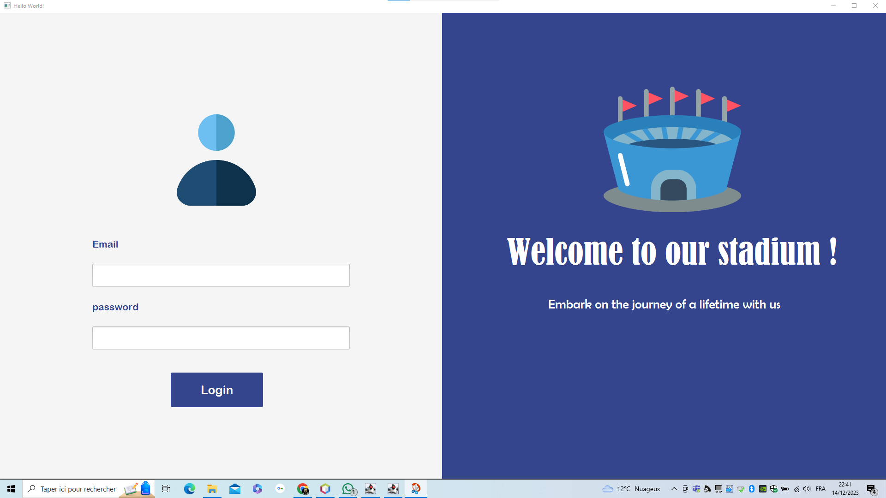
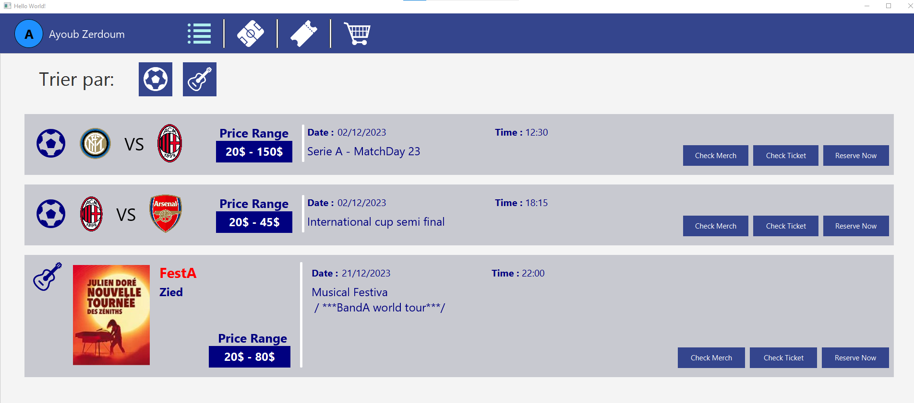
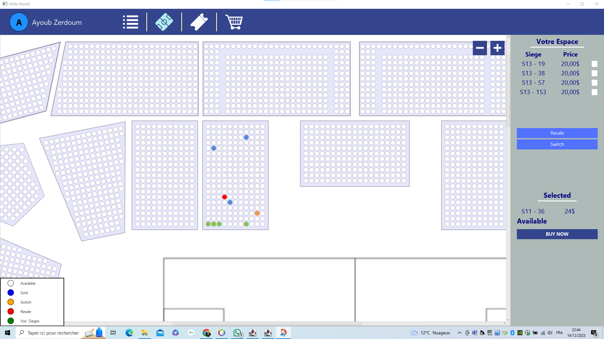

# Stadium Concert Ticket Sales Application

Developed as an academic project by:
- Ayoub ZERDOUM
- Mohamed Zied BOUOUD

## Project Overview
The application should allow users to :
<ul>
  <li>choose an event to attend</li>
  <li>view the stadium (top view)</li>
  <li>choose their seats</li>
  <li>purchase tickets for the seats</li>
  <li>purchase items from the stadium store</li>
</ul>
<strong>The goal is to provide a comprehensive and engaging user experience.</strong>

the application also provides an interface for the admin to : 
<ul>
  <li>configure the layout of its stadium</li>
  <li>add events ( match or concert) </li>
  <li>choose the available seats for each event</li>
  <li>choose the price of each section of the stadium</li>
</ul>

## Detailed Features

### USERS INTERFACES

<strong>Authentification</strong>

<strong>CHECK events , concerts and matchs</strong>

<strong>CHECK events , concerts and matchs</strong>

